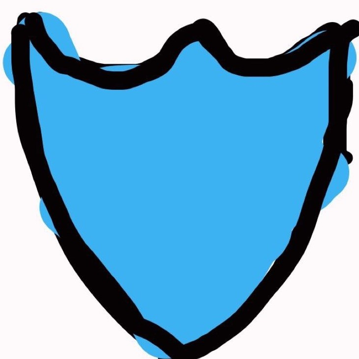

# SafeGuard
The SafeGuard program scans for files and directorys which are threats and deletes them, this script is  
made to be ran at start up and random times to check security and PC vulnerability. [Safeguard.com](https://itzcozi.github.io/SafeGuard/)

## Usage
Most people install SafeGuard and almost never touch it after its installed the reason for this is SafeGuard is  
completely automated. The script will run at startup (if turned on [run on startup](https://itzcozi.github.io/SafeGuard/data/run-on-startup.html)) and randomly  
if the system has been dormant this is to minimize user interaction. Although if a threat is detected  
the system will delete it and run multipule scans and checks (with user consent).

[Usage and Installation Guide](https://github.com/itzCozi/SafeGuard/wiki/User-Manual)

## Development
SafeGuard is still under active development for both the c++ and python versions of the app  
We are looking foreward to soon realeasing the c++ version but I am only a solo dev so please have patience.

### Contribution 
There is currently no one else working on this project aside from me although if you are  
interested in developing this app in either langauge please contact me I would love a helper.  
Contact information and other links are at the bottom of this document.

### Under The Hood
Under the hood, Safeguard is actully very complicated the main file contains 300+ lines of code (Python version)  
alone along with a complex hirearcy and file system there is also a c++ version of the app which is faster and 
does not require internet access to run also its much more convenient. The c++ version is still in 
development and is not yet ready for release although the source code is available for reading and editing [SafeGuard C++ Source-Code](https://github.com/itzCozi/SafeGuard/tree/main/C%2B%2B%20Version%20(UNFINISHED)).

Contact Me
---------------------------------
discord: BadDevoleper#4200                                                                                                                                             
Email: Cooperransom08@outlook.com                                                                                                                                      
[Replit](https://replit.com/@cozi08) | 
[Twitter](https://twitter.com/ransom_cooper)